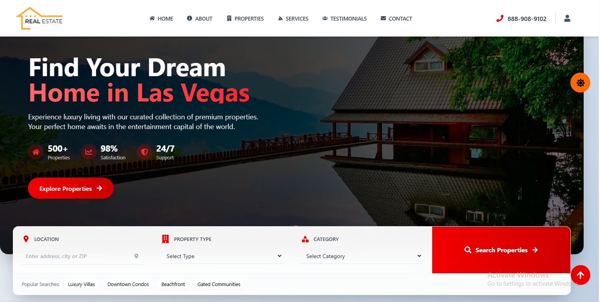
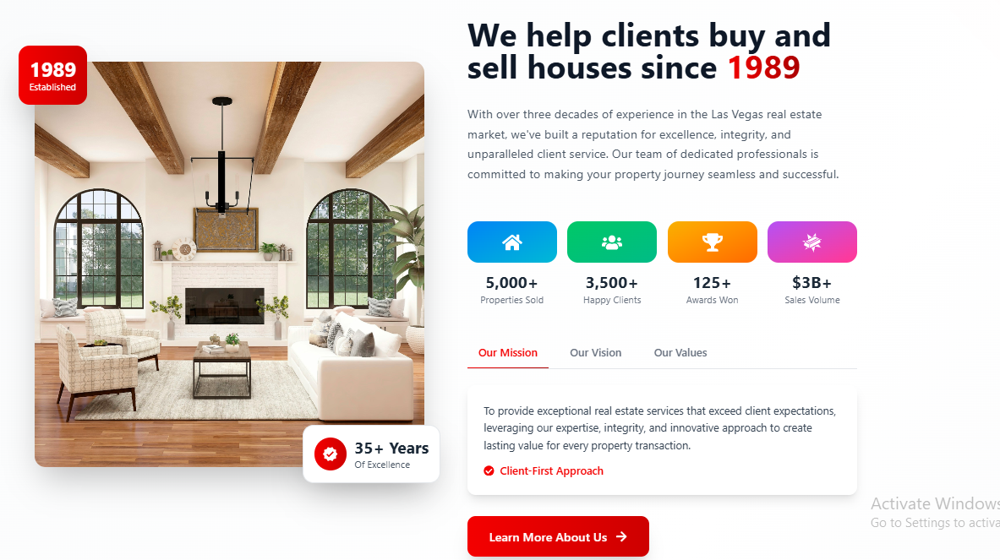
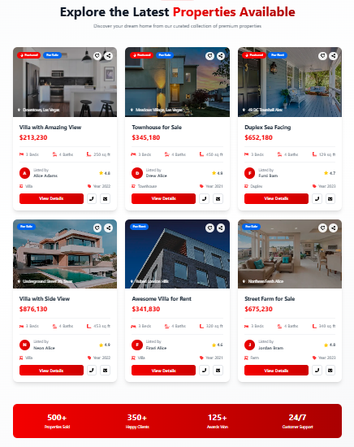
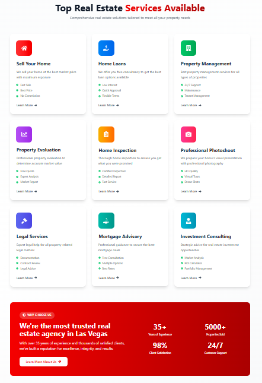
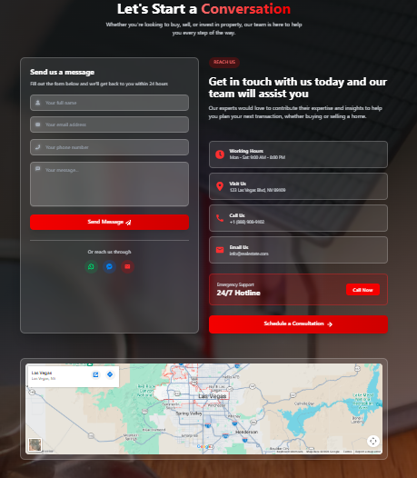
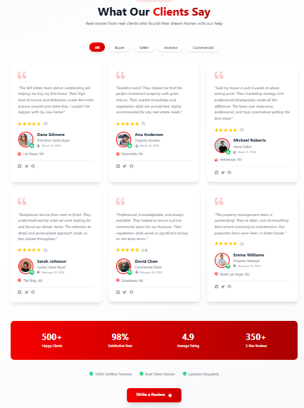

# 🏡 React Property Listing Website

A modern, responsive real estate web application built using React.  
It features multiple sections like Hero, About, Services, Properties, Messages, and Testimonials with smooth animations and a clean UI.

---


## 📸 Project Screenshots

### 🏠 Home / Hero Section


### ℹ️ About Section




### 🛠️ Services Section


### 💬 Message Section


### ⭐ Testimonials Section


---

## ✨ Features

- 🏠 Modern real estate landing page UI
- 🔍 Search & filter functionality
- 🎨 Fully responsive design (mobile + desktop)
- 🎬 Smooth animations using AOS
- ⚡ Fast and optimized React structure
- 🧩 Modular component-based architecture
- 📱 Clean and user-friendly interface

---

## 🧠 Project Structure


React-property-project/
│
├── images/
│ ├── home.PNG
│ ├── about.PNG
│ ├── about1.PNG
│ ├── services.PNG
│ ├── message.PNG
│ ├── test.PNG
│
├── src/
│ ├── about/
│ ├── assets/
│ ├── footer/
│ ├── hero/
│ ├── message/
│ ├── navigation/
│ ├── properties/
│ ├── services/
│ ├── Testnonial/
│ ├── App.jsx
│ ├── main.jsx
│ ├── index.css
│ ├── scroll.jsx
│
├── public/
├── package.json
├── vite.config.js
└── README.md


---

## 🛠️ Tech Stack

- :contentReference[oaicite:1]{index=1}
- :contentReference[oaicite:2]{index=2}
- :contentReference[oaicite:3]{index=3}
- JavaScript (ES6+)
- AOS Animation Library
- React Icons

---

## ⚙️ Installation & Setup

Clone the repository:

```bash
git clone https://github.com/your-username/React-property-project.git

Navigate into project:

cd React-property-project

Install dependencies:

npm install

Run the project:

npm run dev

---

🚀 Future Improvements
Add backend integration (Node.js / Firebase)
Real property API integration
Authentication system (login/register)
Advanced search filters
Admin dashboard for property management

---

👨‍💻 Author
GitHub: https://github.com/Usama112222
LinkedIn: (add your link here)

---

⭐ Support

If you like this project, please give it a ⭐ on GitHub!